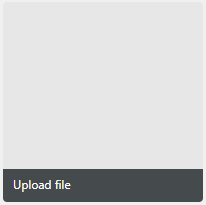
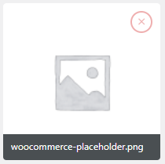

# WP Upload Attachment Handler
Input attachment media in dashboard wordpress, using this function.

## How to use iamgdev-upload-handler.php
```php
$banner_image = '10'; // Default value image
echo iamgdev_upload_handler( 'banner_image', $banner_image, '', array(
	'multiple' => true
) );
```

## Screenshot Example

### Upload


### Upload Selected
